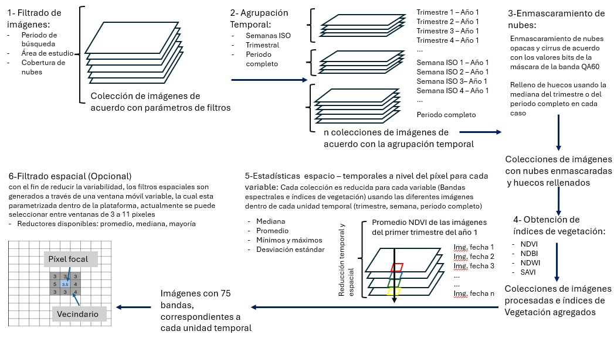
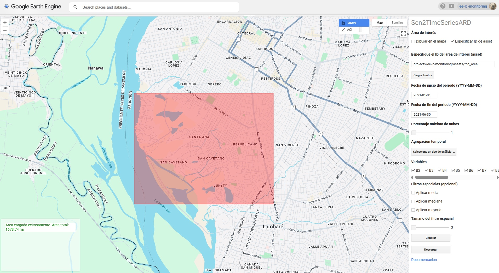
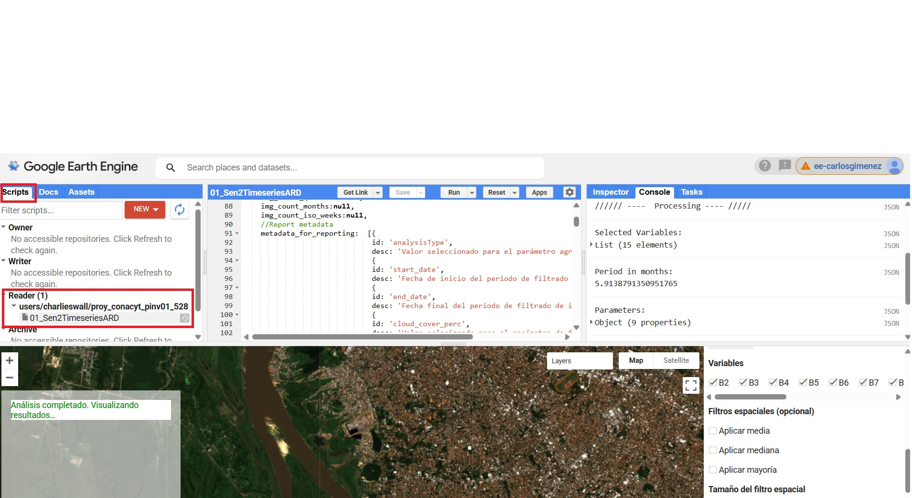

# Sen2TimeSeriesARD
## 1. Introducción
Una aplicación de Google Earth Engine (JS API) para la producción de datos de series temporales, listos para el análisis (ARD), a través del procesamiento de imágenes satelitales Sentinel 2 (Figura 1)

Figura 1. Procesos principales en la generación de datos de sensores remotos a través de la aplicación

La aplicación ha sido desarrollada a través de la API en JavaScript de GEE, lo cual permite la implementación de una interfaz de usuario de manera sencilla y disponible para el uso público sin la necesidad de un desarrollo e implementaciones complejas (Figura 2).  

Figura 2. Interfaz de usuario de la aplicación

Actualmente la aplicación procesa las siguientes variables:

| Variable | Tipo             | Rango típico | Resolución nativa | Descripción |
|----------|------------------|--------------|-------------------|-------------|
| Banda 2  | Datos espectrales | 0 - 0.4      | 10m               | Azul - 496.6nm (S2A) / 492.1nm (S2B) |
| Banda 3  | Datos espectrales | 0 - 0.4      | 10m               | Verde - 560nm (S2A) / 559nm (S2B) |
| Banda 4  | Datos espectrales | 0 - 0.4      | 10m               | Rojo - 664.5nm (S2A) / 665nm (S2B) |
| Banda 5  | Datos espectrales | 0 - 0.4      | 20m               | Límite del rojo 1 - 703.9nm (S2A) / 703.8nm (S2B) |
| Banda 6  | Datos espectrales | 0 - 0.4      | 20m               | Límite del rojo 2 - 740.2nm (S2A) / 739.1nm (S2B) |
| Banda 7  | Datos espectrales | 0 - 0.4      | 20m               | Límite del rojo 3 - 782.5nm (S2A) / 779.7nm (S2B) |
| Banda 8  | Datos espectrales | 0 - 0.4      | 10m               | Infrarrojo cercano - 835.1nm (S2A) / 833nm (S2B) |
| Banda 8A | Datos espectrales | 0 - 0.4      | 20m               | Límite del rojo 4 - 864.8nm (S2A) / 864nm (S2B) |
| Banda 9  | Datos espectrales | 0 - 0.4      | 60m               | Vapor de agua - 945nm (S2A) / 943.2nm (S2B) |
| Banda 11 | Datos espectrales | 0 - 0.4      | 20m               | Infrarrojo de onda corta 1 - 1613.7nm (S2A) / 1610.4nm (S2B) |
| Banda 12 | Datos espectrales | 0 - 0.4      | 20m               | Infrarrojo de onda corta 2 - 2202.4nm (S2A) / 2185.7nm (S2B) |
| NDVI     | Índice espectral  | -1 a +1      | 10m               | Índice de vegetación normalizada |
| SAVI     | Índice espectral  | -1 a +1      | 10m               | Índice de vegetación normalizada ajustado al suelo |
| NDBI     | Índice espectral  | -1 a +1      | 20m               | Índice de Diferencia Normalizada de Áreas Construidas |
| NDWI     | Índice espectral  | -1 a +1      | 10m               | Índice de Diferencia Normalizada de Agua |

## 2. Guía de uso

Una vez generada creada la cuenta en [Google Earth Engine](https://earthengine.google.com/signup/), podrá copiar el repositorio a su cuenta de GEE a través del siguiente [enlace](https://code.earthengine.google.com/?accept_repo=users/charlieswall/proy_conacyt_pinv01_528). Luego los scripts correspondientes se mostrarán en la sección de Scripts > Reader (Figura 3). 

Encontrará mayor información acerca del funcionamiento de la API de JavaScript en GEE a través del siguiente [enlace](https://developers.google.com/earth-engine/tutorials/tutorial_api_01).

Figura 3. Interfaz de usuario de la aplicación

1. Una vez con acceso al script de la aplicación, deberá ejecutar la misma través del botón "RUN". La aplicación será desplegada mostrando la interfaz de usuario, como se puede observar en la figura 1. Una vez desplegada la interfaz, el usuario deberá especificar una serie de parámetros necesarios para ejecutar la aplicación.
   
2. Aquí se listan los parámetros de manera secuencial
   1.  Áreas de interés: El área de interés puede ser especificada a través de el uso de assets de GEE (marcada por defecto) o bien dibujandola en el mapa marcando la opción "Dibujar en el mapa"

