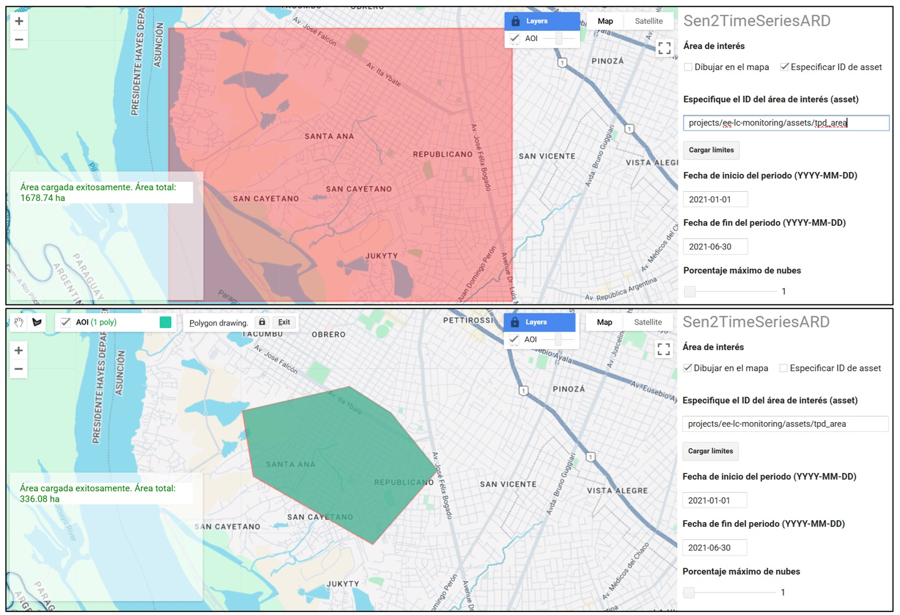
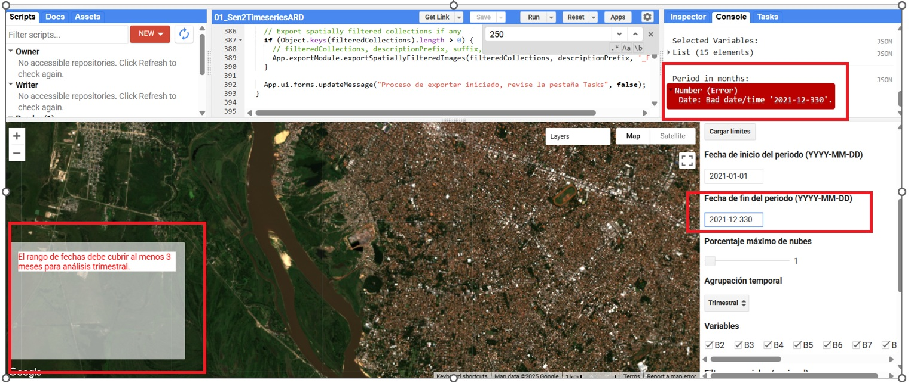
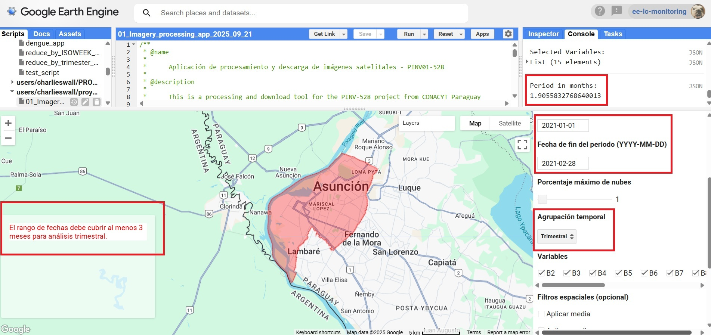
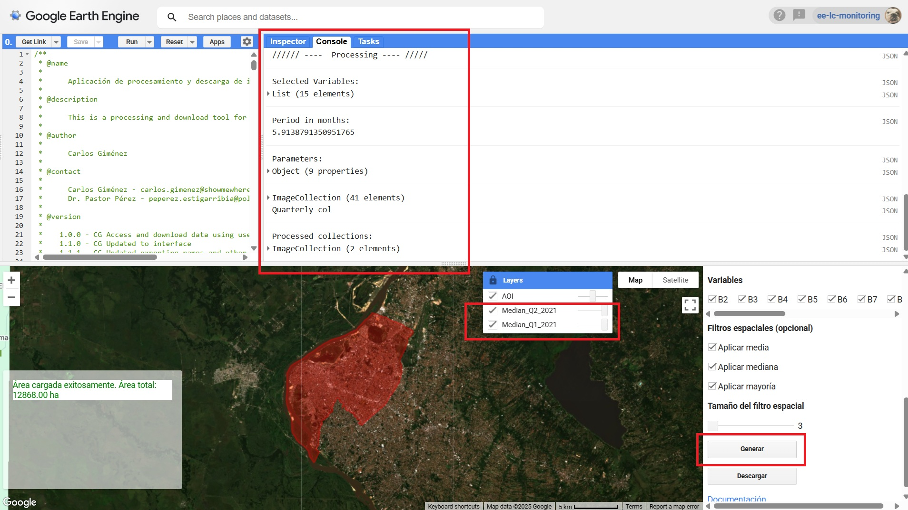
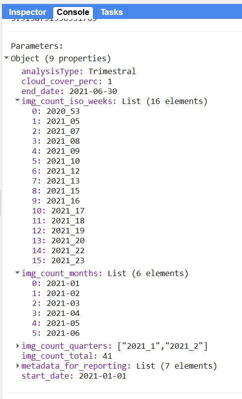
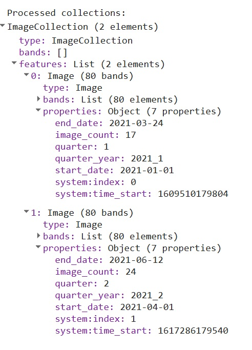
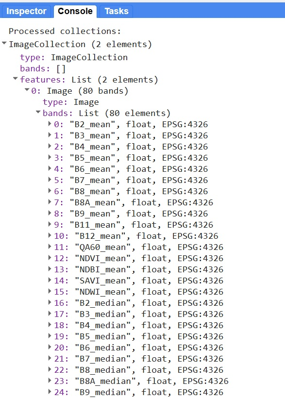

# Sen2TimeSeriesARD
## 1. Introducción
Una aplicación de Google Earth Engine (JS API) para la producción de datos de series temporales, listos para el análisis (ARD), a través del procesamiento de imágenes satelitales Sentinel 2 (Figura 1).

Figura 1. Procesos principales en la generación de datos de sensores remotos a través de la aplicación

La aplicación ha sido desarrollada a través de la API en JavaScript de GEE, lo cual permite la implementación de una interfaz de usuario de manera sencilla y disponible para el uso público sin la necesidad de un desarrollo e implementaciones complejas (Figura 2).  

Figura 2. Interfaz de usuario de la aplicación

### 1.2 Especificaciones

Actualmente la aplicación procesa las siguientes variables:

Cuadro 1. Variables procesadas por la aplicación

| Variable | Tipo             | Rango típico | Resolución nativa | Descripción |
|----------|------------------|--------------|-------------------|-------------|
| Banda 2  | Datos espectrales | 0 - 0.4      | 10m               | Azul - 496.6nm (S2A) / 492.1nm (S2B) |
| Banda 3  | Datos espectrales | 0 - 0.4      | 10m               | Verde - 560nm (S2A) / 559nm (S2B) |
| Banda 4  | Datos espectrales | 0 - 0.4      | 10m               | Rojo - 664.5nm (S2A) / 665nm (S2B) |
| Banda 5  | Datos espectrales | 0 - 0.4      | 20m               | Límite del rojo 1 - 703.9nm (S2A) / 703.8nm (S2B) |
| Banda 6  | Datos espectrales | 0 - 0.4      | 20m               | Límite del rojo 2 - 740.2nm (S2A) / 739.1nm (S2B) |
| Banda 7  | Datos espectrales | 0 - 0.4      | 20m               | Límite del rojo 3 - 782.5nm (S2A) / 779.7nm (S2B) |
| Banda 8  | Datos espectrales | 0 - 0.4      | 10m               | Infrarrojo cercano - 835.1nm (S2A) / 833nm (S2B) |
| Banda 8A | Datos espectrales | 0 - 0.4      | 20m               | Límite del rojo 4 - 864.8nm (S2A) / 864nm (S2B) |
| Banda 9  | Datos espectrales | 0 - 0.4      | 60m               | Vapor de agua - 945nm (S2A) / 943.2nm (S2B) |
| Banda 11 | Datos espectrales | 0 - 0.4      | 20m               | Infrarrojo de onda corta 1 - 1613.7nm (S2A) / 1610.4nm (S2B) |
| Banda 12 | Datos espectrales | 0 - 0.4      | 20m               | Infrarrojo de onda corta 2 - 2202.4nm (S2A) / 2185.7nm (S2B) |
| NDVI     | Índice espectral  | -1 a +1      | 10m               | Índice de vegetación normalizada |
| SAVI     | Índice espectral  | -1 a +1      | 10m               | Índice de vegetación normalizada ajustado al suelo |
| NDBI     | Índice espectral  | -1 a +1      | 20m               | Índice de Diferencia Normalizada de Áreas Construidas |
| NDWI     | Índice espectral  | -1 a +1      | 10m               | Índice de Diferencia Normalizada de Agua |

### 1.2.1 Filtrado de nubes

!!!!!!!!!!! A DESARROLLAR !!!!!

## 2. Guía de uso

Una vez generada creada la cuenta en [Google Earth Engine](https://earthengine.google.com/signup/), podrá copiar el repositorio a su cuenta de GEE a través del siguiente [enlace](https://code.earthengine.google.com/?accept_repo=users/charlieswall/proy_conacyt_pinv01_528). Luego los scripts correspondientes se mostrarán en la sección de Scripts > Reader (Figura 3). 

Encontrará mayor información acerca del funcionamiento de la API de JavaScript en GEE a través del siguiente [enlace](https://developers.google.com/earth-engine/tutorials/tutorial_api_01).

Figura 3. Interfaz de usuario de la aplicación

### 2.1. Acceso a la aplicación
 Una vez con acceso al script de la aplicación, deberá ejecutar la misma a través del botón "RUN". La aplicación será desplegada mostrando la interfaz de usuario, como se puede observar en la figura 1. Una vez desplegada la interfaz, el usuario deberá especificar una serie de parámetros necesarios para ejecutar la aplicación.
   
### 2.2. Parámetros

Aquí se listan los parámetros de manera secuencial: 

+ **Áreas de interés (AOI):** El área de interés puede ser especificada a través de el uso de assets de GEE (marcada por defecto) o bien dibujandola en el mapa marcando la opción "Dibujar en el mapa", luego se debe cargar el polígono en la aplicación a través de el botón "Cargar límites".
   
   
   Figura 4. Opciones de carga de áreas de interés (AOI)
   
   La aplicación procesará el área de estudio y generará mensajes en el panel de la esquina inferior izquierda, en donde, entre otros aparecerá el área estimada del AOI
   
   Aquí es importante mencionar que la aplicación cuenta con una limitación de tamaño del área de estudio (250.000 ha) impuesta de manera intencional, esto a fin de evitar errores por excesos de capacidad de computo de los usuarios. Usuarios intermedios y avanzados pueden modificar dicho límite a su discreción.
   
+ **Fechas de inicio y fin del periodo de interés:** los usuarios deberán especificar la fecha de inicio y fin del periodo de la aplicación en formato (YYYY-MM-DD). La aplicación validará el periodo teniendo en cuenta el tipo de agrupación temporal especificada o bien simplemente la validez del periodo en sí (figura 5).
  
  Es importante tener en cuenta que las imágenes consideradas dependerán principalmente del periodo de busqueda, es decir las imágenes encontradas entre la fecha de inicio y fin.
  
  
  Figura 5. Validación del periodo de búsqueda 
  
  Por defecto la aplicación calcula del periodo en meses, esto puede ser verificado en la pestaña de "Console" en donde se muestran esta y otras informaciones, así como también potenciales errores que pudiesen saltar de parte de GEE.

+ **Porcentaje máximo de nubes:** el usuario deberá especificar el valor máximo de cobertura de nubes permitido, este valor es comparado con el valor del campo 'CLOUDY_PIXEL_PERCENTAGE' de cada imagen sentinel, excluyendo todas las imágenes por encima del valor proporcionado.
  
+ **Agrupación temporal:** el usuario deberá elegir el tipo de agregación temporal al cual se someterá a las imágenes. Este valor define de que manera se divirá la colección (Trimestral, Semanas ISO o Periodo completo). En cada caso se validará el periodo de acuerdo a la unidad temporal elegida, por ejemplo, en caso de elegirse la agrupación "Trimestral", la aplicación calculará y requerirá un periodo mínimo de 3 meses. Por otro lado, en caso de elegirse la agrupación por semanas ISO, se requerirá que el periodo cubra al menos 1 semana ISO.
    
    
    Figura 6. Elección de agrupación temporal. 
    
    A continuación se describen las opciones de agrupación temporal:

    **a-) Trimestral:** en este modo de agrupación, los datos de la colección son agrupados según los trimestres de cada año dentro del periodo. Es importante tener en cuenta que solo se consideran los datos filtrados y no agregan imágenes a modo de abarcar el periodo completo, es decir, si el periodo abarca de manera parcial ciertos trimestres, los datos dentro de cada trimestre solo estarán conformados por las imágenes filtradas en dicho periodo y según los demás parámetros.

    **b-) Semanas ISO:** las imágenes son agrupadas por semanas ISO de acuerdo con la norma ISO 8601 en donde, la semana 1 de un año es la primera semana que contiene un jueves.

    **c-) Periodo completo:** en este modo la unidad temporal de agrupación es simplemente el periodo de busqueda. Este modo de agrupación permite máxima flexibilidad en términos de filtros temporales.

+ **Variables**: es posible seleccionar que variables serán incluidas para su procesamiento. Actualmente, la aplicación cuenta con 15 variables, entre las que se encuentran 11 bandas espectrales y 4 índices de vegetación (NDVI, NDWI, NDBI y SAVI) (ver cuadro 1).

+ **Filtros espaciales (opcional)**: Opcionalmente, la aplicación puede aplicar filtros espaciales sobre los productos ya agrupados temporalmente. Estos filtros modifican el valor de cada píxel utilizando su vecindad para calcular la media, la mediana o la moda (mayoría). Para ello, se emplea una ventana o "kernel" cuadrangular cuyo tamaño se ajusta con el parámetro "Tamaño del filtro espacial", que define el número de píxeles por lado de dicha ventana.

### 2.3 Procesamiento y revisión iterativa
Una vez especificados todos los parámetros, se debe ejecutar el proceso haciendo click en el botón "Generar". Los resultados serán generados, e impresos en la consola de la interfaz de GEE. Así mismo, se agregarán composiciones al mapa utilizando la mediana de cada unidad temporal a fin de observar visualmente los resultados. 

Cada vez que el botón "Generar" sea ejecutado, la aplicación procederá a colectar todos los parámetros, generar la consulta y procesar las agrupaciones y filtrados de acuerdo a lo especificado. Por lo que de esta manera, es posible ir probando los parámetros y verificando los resultados tanto en la consola como en el mapa. 

En el siguiente ejemplo, utilizaremos como área de estudio la ciudad de Asunción, Paraguay, y verificaremos los resultados aplicando los siguientes parámetros:

- periodo: 2021-01-01, 2021-06-30
- Porcentaje máximo de nubes: 1 %
- Agrupación temporal: Trimestral
- Variables: 15 variables (B2-B12, NDVI, NDWI, NDBI, SAVI)
- Filtros espaciales: media, mediana y mayoría
- Tamaño de filtro espacial: 3 píxeles

Como se ha mencionado anteriormente, cada vez que el botón "Generar" es ejecutado, la aplicación imprimirá en la consola una nueva sección de "Processing" debajo de la cual se mostrarán los parámetros utilizados, y datos referentes a los resultados analizados de las imágenes, como por ejemplo:

 - Las variables seleccionadas: el listado de variables procesadas
 - Periodo en meses: el periodo comprendido por la fecha inicial y final en meses
 - Parámetros: listado de parámetros utilizados y resultados como: conteo de imágenes, semanas ISO dentro del periodo, semanas ISO con datos y sin datos de acuerdo con los resultados, número total de imágenes, trimestres presentes, entre otros. 
  
  Figura 7. Resultados impresos en la consola

En el ejemplo de la figura 8 se observa el campo "img_count_total" que reporta la cantidad de imágenes filtradas, el campo "img_count_iso_weeks" presenta las semanas ISO que registraron datos en el formato "YYYY_ISO_WEEK". Así mismo, también se presentan los meses con datos en el formato "YYYY-MM" y
 los trimestres presentes en el periodo de busqueda a través del campo "img_count_quarters" en formato "YYYY-Trimestre".

Figura 8. Resumen de datos procesados por la aplicación

 - Colección de imágenes filtradas (ImageCollection): colección de imágenes conteniendo el total de imágenes filtradas según el área de estudio, periodo y cobertura de nubes. Esta variable es útil para la revisión de las imágenes presentes dentro de los datos procesados, como por ejemplo: números de imágenes por grilla, número de imágenes por mes y el id de cada imagen en caso de querer visualizarlas individualmente. 

 - Colección procesada (Processed collection): contiene una imágen por cada unidad temporal encontrada, es decir, en nuestro ejemplo, se encontraron 2 trimestres en los datos, por lo que se generó una imagen para cada trimestre. La aplicación también genera propiedades de cada conjunto de imágenes utilizadas para la composición de cada imagen resultante, como por ejemplo, la cantidad de imágenes agrupadas por unidad temporal a través del campo "image_count", la fecha de la primera y última imagen en orden temporal utilizando los campos "start_date" y "end_date" (Figura 9)
 
 

Figura 9. Datos de imágenes resultantes

Cada imagen contiene las diferentes variables procesadas como por ejemplo para las variables B2 y NDVI se generaron B2_mean, B2_max,B2_min,B2_median,B2_stdDev y NDVI_mean, NDVI_max, NDVI_min,NDVI_median, NDVI_stdDev como se puede ver en la figura 10.

Figura 9. Datos de imágenes resultantes

