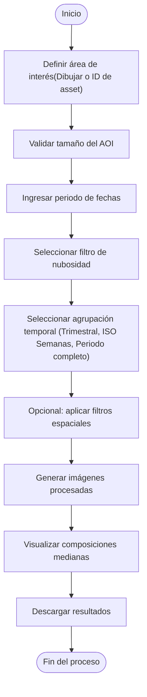

## Diagrama de flujo - App PINV01-528

```mermaid

flowchart TD
    Start([Inicio])
    AOI["Definir área de interés(Dibujar o ID de asset)"]
    ValidateAOI[Validar tamaño del AOI]
    Periodo[Ingresar periodo de fechas]
    CloudFilter[Seleccionar filtro de nubosidad]
    Aggregation["Seleccionar agrupación temporal (Trimestral, ISO Semanas, Periodo completo)"]
    SpatialFilter[Opcional: aplicar filtros espaciales]
    Generate[Generar imágenes procesadas]
    Visualizar[Visualizar composiciones medianas]
    Descargar[Descargar resultados]
    Fin([Fin del proceso])

    Start --> AOI
    AOI --> ValidateAOI
    ValidateAOI --> Periodo
    Periodo --> CloudFilter
    CloudFilter --> Aggregation
    Aggregation --> SpatialFilter
    SpatialFilter --> Generate
    Generate --> Visualizar
    Visualizar --> Descargar
    Descargar --> Fin

```